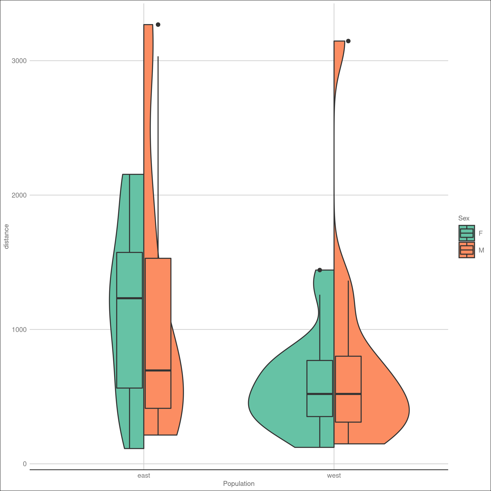

```{r setup, include=FALSE}
knitr::opts_chunk$set(echo = FALSE)
```

```{r, echo=FALSE}
load('myEnvironment.RData')
```


## Results: data exploring

- Data augmentation : new variables created: *efficiency* and *distance_class*
- Plots to visualize our data and generally understand them
- Analysis of data through:  
    - Plot visualization also replicating some from the paper  
    - Logistic regression  
    - PCA analysis and KNN   


## Methods
<div class="rows-2">
  
    
- dasdas
- dasdas
  
  
  
<div class="centered"> 
{width=30%}
{width=30%} 
 </div>
 </div>

## test


```{r, echo=FALSE}
load('myEnvironment.RData')
```
 


