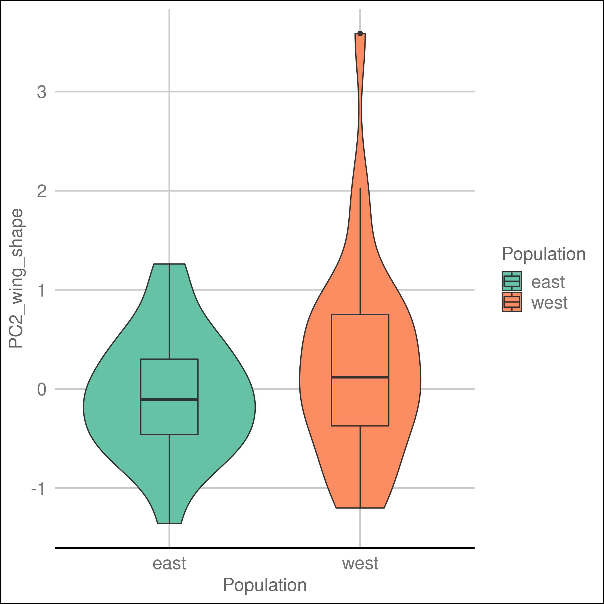

```{r setup, include=FALSE}
knitr::opts_chunk$set(echo = FALSE)

```

```{r echo=FALSE}
library("ggthemes")
library("tidyverse")
library("mltools")
library("broom")
library("RColorBrewer")
library("dplyr")
library("ggpubr")
library("ggridges")
library("reshape2")
library("GGally")
library("readr")
library("tibble")
library("caret")
library("broom")
library("factoextra")
```

```{r}
load('../myEnvironment.RData')
```


```{r echo=FALSE}
gene_expr_data <- read_tsv(file = "../data/04_gene_expr_data.tsv",
                           show_col_types = FALSE)
```

<style>
div.footnotes {
  position: absolute;
  bottom: 0;
  right: 0;
  margin-bottom: 15px;
  margin-right: 150px;
  margin-left: 10px;
  width: 70%;
  font-size: 0.3em;
}
</style>

<script src="https://ajax.googleapis.com/ajax/libs/jquery/3.1.1/jquery.min.js"></script>

<script>
  $(document).ready(function() {
    $('slide:not(.backdrop):not(.title-slide)').append('<div class=\"footnotes\">');

    $('footnote').each(function(index) {
      var text  = $(this).html();
      var fnNum = (index+1).toString().sup();
      $(this).html(text + fnNum);

      var footnote   = fnNum + ': ' + $(this).attr('content') + '<br/>';
      var oldContent = $(this).parents('slide').children('div.footnotes').html();
      var newContent = oldContent + footnote;
      $(this).parents('slide').children('div.footnotes').html(newContent);
    });
  });
</script>

## Gene expression and flight performance analysis for different monarch populations

<div class="columns-2">

Analysis of two monarch populations, <span style="color:black">East</span> and <span style="color:red">West</span>:

  - Differences in flight performance 
  - Correlation in the genetic profile </br>of 6 genes involved in movement

  
{width=110%}
<center><font size="4"><footnote content="Talla, Venkat, et al. “Genomic Evidence for Gene Flow between Monarchs with Divergent Migratory Phenotypes and Flight Performance.” Molecular Ecology, vol. 29, no. 14, 2020, pp. 2567–2582">Map showing sampling locations</footnote></font></center>

</div>

## Flowchart{.flexbox .vcenter}


```{r}
library("DiagrammeR")
DiagrammeR::grViz("digraph {

graph [layout = dot, rankdir = LR]

# define the global styles of the nodes. We can override these in box if we wish
node [shape = rectangle, style = filled, fillcolor = Linen]

data1 [label = 'Dataset 1', shape = folder, fillcolor = Beige]
data2 [label = 'Dataset 2', shape = folder, fillcolor = Beige]
process [label =  'Data \n Processing']
augment [label = 'Data \n Augmentation']
visual [label = 'Data \n Visualizations']
statistical [label = 'Statistical \n Analysis']
results [label= 'Results']

# edge definitions with the node IDs
{data1 data2}  -> process -> augment -> visual -> statistical -> results
}")
```

## Dataset
This is the final joined dataset we used for our analysis
```{r}
my_data <- read_tsv(file = "../data/02_my_data_clean.tsv",
                    show_col_types = FALSE)
head(my_data)
```

## Methods
 - Data augmentation - new variables created: efficiency and distance_class
 - Plot visualizations - plots to visualize our data and generally understand them
 - Statistical analysis:
    - Visualizations of augmented variables
    - Logistic regression
    - PCA analysis and KNN

## Results : Data exploring
<div class="rows-2">

```{r echo=TRUE}
plots = map(numeric_ones, 
            ~datadistribution_plot("Population",
                                   ., 
                                   my_data_clean))
```
<div>
<div class="columns-2">
<div align="center">
{width=69%}


{width=69%}
</div>
</div>
</div>
</div>

## Results : Data visualization
<div class="columns-2">

</div>

## Modelling on the gene expression data

<div class="columns-2">

{width=90%}

Logistic regression on the gene expressions for evaluating significance in populations 
</div>


