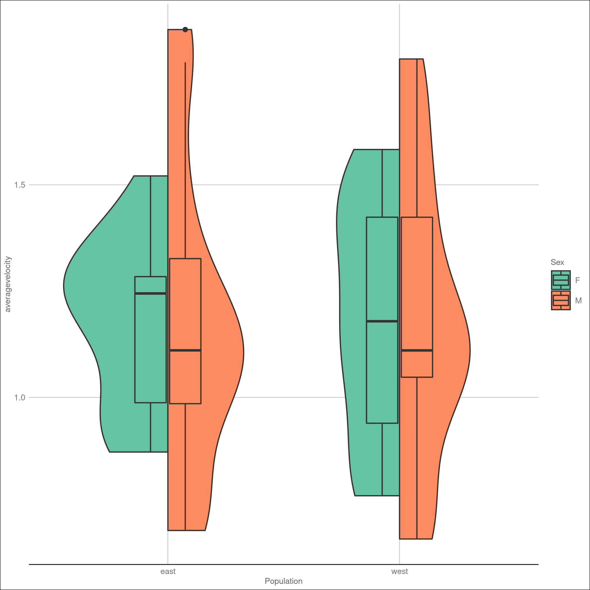

```{r setup, include=FALSE}
knitr::opts_chunk$set(echo = FALSE)
```

## Results: data exploring

- Data augmentation : new variables created: *efficiency* and *distance_class*
- Plots to visualize our data and generally understand them
- Analysis of data through:  
    - Plot visualization also replicating some from the paper  
    - Logistic regression  
    - PCA analysis and KNN   


## Methods
<div class="rows-2">
  
    
### <b>

<font size="4">plots = map(numeric_ones,  
&nbsp;&nbsp;&nbsp;&nbsp;&nbsp;&nbsp;&nbsp;&nbsp;&nbsp;&nbsp;&nbsp;&nbsp;&nbsp;&nbsp;&nbsp;&nbsp;&nbsp;&nbsp;&nbsp;&nbsp;&nbsp;&nbsp;  ~datadistribution_plot("Population",  
&nbsp;&nbsp;&nbsp;&nbsp;&nbsp;&nbsp;&nbsp;&nbsp;&nbsp;&nbsp;&nbsp;&nbsp;&nbsp;&nbsp;&nbsp;&nbsp;&nbsp;&nbsp;&nbsp;&nbsp;&nbsp;&nbsp;&nbsp;&nbsp;&nbsp;&nbsp;&nbsp;&nbsp;&nbsp;&nbsp;&nbsp;&nbsp;&nbsp;&nbsp;&nbsp;&nbsp;&nbsp;&nbsp;&nbsp;&nbsp;  ., 
                                   my_data_clean))</font>
                                   
### </b>  
  
  
<div class="centered"> 
{width=45%}
{width=45%} 
 </div>
 </div>

## test

{r, file=c('one.R', 'two.R')}
```{r, file=c('one.R', 'two.R')}

```
 
```
## test2

```{r}
pl5
```

